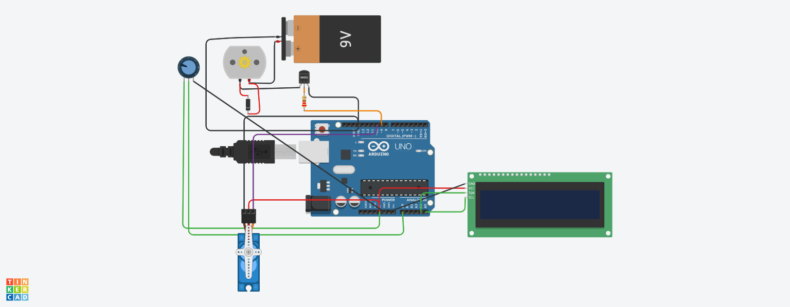

# Automatic Sprinkler System with LCD & PWM Control

##  Deskripsi

Proyek ini adalah sistem penyiram otomatis berbasis Arduino yang menggunakan:

* Motor pompa air (dikontrol PWM)
* Servo (opsional untuk arah semprotan)
* LCD I2C sebagai display
* Potensiometer sebagai pengatur kecepatan motor

Sistem ini memungkinkan pengguna mengatur kecepatan pompa secara real-time dan menampilkan nilainya di LCD.

---

##  Fitur Utama

* Kontrol kecepatan motor menggunakan PWM
* Monitoring kecepatan melalui LCD 16x2 I2C
* Input analog menggunakan potensiometer
* Driver motor menggunakan MOSFET
* Catu daya eksternal (baterai 9V)

---

##  Komponen (B)

* Arduino UNO
* LCD 16x2 I2C
* Motor DC / Pompa air
* Servo (SG90 atau sejenis)
* MOSFET (N-Channel)
* Dioda (flyback)
* Resistor 220Ω
* Potensiometer (±10k–250k)
* Baterai 9V
* Kabel jumper

---

##  Wiring (Koneksi)

### LCD I2C

* VCC → 5V Arduino
* GND → GND
* SDA → A4
* SCL → A5

### Potensiometer

* Pin tengah → A0
* Sisi kiri → GND
* Sisi kanan → 5V

### Motor + MOSFET

* Drain MOSFET → Motor (-)
* Source → GND
* Gate → Pin PWM Arduino (misal D9)
* Motor (+) → 9V
* Dioda paralel motor (flyback)

### Servo

* VCC → 5V
* GND → GND
* Signal → D3

---

##  Cara Kerja

1. Potensiometer dibaca oleh Arduino (analog input)
2. Nilai tersebut dikonversi menjadi PWM (0–255)
3. PWM mengatur kecepatan motor melalui MOSFET
4. Nilai kecepatan ditampilkan pada LCD
5. Servo dapat digunakan untuk mengatur arah penyiraman

---

## Program

File program utama:

```
bodacious_jaagub_wolt1.ino
```

---

##  Cara Menjalankan

1. Upload file `.ino` ke Arduino menggunakan Arduino IDE
2. Pastikan library berikut sudah terinstall:

   * LiquidCrystal_I2C
   * Servo
3. Rangkai sesuai wiring diagram
4. Nyalakan sistem

---

##  Preview Rangkaian



---

##  Dibuat Dengan

* Tinkercad
* Arduino IDE

---

##  Author

Nama: (Dibell)

---
